# Component reference

Every piece of the shared UI, one entry each: **what it is, when to use it, its arguments, a working example, how it behaves on
the server, what it is related to** (the React component behind it, the CSS, the translation keys, the functions it is used with)
and **a screenshot**. Screenshots were taken from the live apps (`shell_*`, `page_*`, `wizard_*`) and from the component
gallery (`cd_*`): run the gallery yourself with

```r
shiny::runApp("apps/_shared/docs/gallery")            # rmncah (maroon) theme
# GALLERY_THEME=vaccine  or  GALLERY_THEME=pooled     # environment variable to see the other themes
```

Every image lives in [`img/`](img/). Read [`../README.md`](../README.md) first for how the pieces fit together, and
[`HOWTO.md`](HOWTO.md) for recipes.

**Contents**
[Conventions](#conventions) ·
[1 App shell](#1-app-shell) ·
[2 Pages and the registry](#2-pages-and-the-registry) ·
[3 Filters and inputs](#3-filters-and-inputs) ·
[4 Cards, tabs and charts](#4-cards-tabs-and-charts) ·
[5 Tables and downloads](#5-tables-and-downloads) ·
[6 Feedback, files and dialogs](#6-feedback-files-and-dialogs) ·
[7 Actions](#7-actions) ·
[8 Shiny and translation helpers](#8-shiny-and-translation-helpers) ·
[9 The Load Data wizard](#9-the-load-data-wizard) ·
[10 Shared page modules](#10-shared-page-modules) ·
[11 Themes](#11-themes) ·
[12 The React side](#12-the-react-side)

---

## Conventions

* **Names.** Everything is `snake_case` and starts with `cd_` (`CONVENTIONS.md`). A Shiny module is a pair, `<stem>_ui()` and
  `<stem>_server()`. A React component `CdButton` is `cd_button()` in R.
* **Ids.** `id` / `inputId` arguments are *already namespaced* (`ns("x")`) unless the entry says it takes a module id.
* **Text is a translation key.** Any `label`, `title`, `hint`, `subtitle` argument takes a key (or the markup
  `i18n$t("key")` returns for one). A string that is not a key is shown as it is, in every language. React components receive
  every language at once (`cd_text()`), so they re-render themselves when the language changes.
* **Inputs are `shiny.react` inputs.** `input$<inputId>` holds the value. **Buttons are one-shot events**: `input$<id>` is
  `NULL` until the first click, so `observeEvent(input$<id>, ...)` needs no `ignoreInit`.
* **Pushing to a component.** `cd_update_input(inputId, session, value = ...)` changes a component that is already on the page, but
  only after it has *mounted*; a message to one that has not is lost. Wait with `cd_mounted()` / `cd_remounted()`.
* **`active`.** A page server takes `active`, a reactive that is TRUE once the page has been opened with data loaded and stays TRUE.
  Gate heavy work on `req(cache(), active())`.

---

## 1. App shell


The shell is the frame around every page: the **header** (logo, breadcrumb, dataset pill, language switch, Ask AI, Download
report), the **sidebar** (sections, groups, locked items) and the **content area**. An app never builds these; it calls `cd_app()`.

### `cd_app()`

Builds the whole app (page, sidebar/header, server) and returns the `shinyApp`. It is the last expression of an app's `app.R`.

```r
cd_app(app_name, app_version, theme, nav_sections, registry, i18n, language, selected_file)
```

| Argument | Meaning |
| --- | --- |
| `app_name`, `app_version` | shown under the logo (`Countdown` / `RMNCAH · v2.0.0`) |
| `theme` | `NULL`/`"rmncah"` (maroon), `"vaccine"` (blue), `"pooled"` (green) - see [Themes](#11-themes) |
| `nav_sections` | the nav tree: a list of `cd_nav_section()` |
| `registry` | the page registry (`cd_page_registry` from `pages.R`) |
| `i18n`, `language` | the translator and the starting language |
| `selected_file` | the dataset DataSuite passed (`CDSUITE_SHINY_SELECTED_FILE`), or `NA` |

What the server it builds does (so you do not have to): starts the app's `introduction_server()` and `upload_data_server()`; keeps
`data_ready` (a dataset with data has loaded) and `analysis_ready` (it has also been adjusted) and passes them to the sidebar so
items lock and unlock; snaps back to Load Data if a locked tab is reached another way; latches `page_is()` (`active`) per page;
keeps the language in sync between the picker and the dataset; renders the header dataset pill and the Download report button; and
starts every page and header server from the registry. It expects the app to define `introduction_ui/_server` and
`upload_data_ui/_server`. **Related:** `cd_app_ui`, `cd_shell_server`, `cd_pages_ui/_server`; source `R/core/app.R`.

### `cd_app_ui()`, `cd_app_bar()`, `cd_sidebar()`, `cd_app_body()`, `cd_screens()`, `cd_screen()`

The pieces `cd_app()` assembles; use them directly only for something that is not a normal app (the pooled app and the gallery do).

```r
ui <- cd_app_ui(theme = "pooled", title = "Pooled",
  header = cd_app_bar("Pooled", "2.0.0"), sidebar = cd_sidebar(),
  body = cd_app_body(usei18n(i18n), cd_head_assets(),
    cd_screens(cd_screen(tabName = "pooling", ...))))
```

* `cd_app_ui(header, sidebar, body, title, theme)` - the HTML page: jQuery, meta tags, the [start-up loader](#cd_startup_loader), the
  `cd-theme-<theme>` class on `<body>`.
* `cd_app_bar(app_name, app_version)` - the header. Its right-hand outputs (`cd_header_crumb`, `header_pill`, `download_buttons`,
  `cd_header_actions`) are rendered by `cd_shell_server()` and by `cd_app()`.
* `cd_screens(...)` / `cd_screen(tabName, ...)` - the top-level page containers (`div#cd-page-<tabName>`); exactly one is shown, switched
  by the sidebar (`nav.ts`).
* `cd_app_body(...)` - the padded content area.

### `cd_nav_section()`, `cd_nav_item()` and the standard sections


The sidebar is data: a list of sections, each a list of items.

```r
cd_nav_section("lbl_nav_section_quality",
  cd_nav_item("title_nav_quality", icon = "check-circle", children = list(          # a group (no tabName)
    cd_nav_item("title_rr_main", tabName = "reporting_rate", icon = "chart-bar"))),  # a leaf
  cd_nav_item("btn_adjust_remove_years", tabName = "remove_years", icon = "trash"))
```

| Function | Arguments |
| --- | --- |
| `cd_nav_section(label, ...)` | `label`: translation key of the small uppercase heading; `...` the items |
| `cd_nav_item(label, tabName, icon, i18n, children, requires_adjustment)` | a leaf has `tabName` (matches a `cd_screen()` and a registry `id`); a group has `children`. `icon` is a Font Awesome name. `requires_adjustment = TRUE` locks it until Data Adjustment has run (only set on top-level items) |

The sections both apps share: `cd_nav_start()` (Introduction, Load Data), `cd_nav_quality()` (Data Quality, Remove Years, Data
Adjustment), `cd_nav_denominators()`, `cd_nav_national(extra = list())` and `cd_nav_subnational()` (`extra`: more items for that group,
e.g. rmncah's Continuum of Care). An app composes them and adds its own groups:

```r
cd_nav_sections <- list(cd_nav_start(), cd_nav_quality(), cd_nav_denominators(),
  cd_nav_section("lbl_nav_section_analysis", cd_nav_national(), cd_nav_subnational()))
```

Locking: everything except Introduction and Load Data is locked (padlock, greyed) until a dataset has loaded; a click on a locked item
shows a notification (`err_nav_locked`). **Related:** `cd_shell_server()`, React `Sidebar`, `nav.ts`; source `R/layout/shell.R`, `nav-sections.R`.

### `cd_shell_server()`

`cd_shell_server(output, sections, initial_tab, data_ready, analysis_ready = data_ready, i18n, docs_href)` renders the sidebar, the
breadcrumb and the header actions, and locks items as `data_ready()` / `analysis_ready()` change. `cd_app()` calls it; call it yourself
only in a custom app, with `data_ready = reactive(TRUE)` if nothing needs locking.

### `cd_startup_loader()`

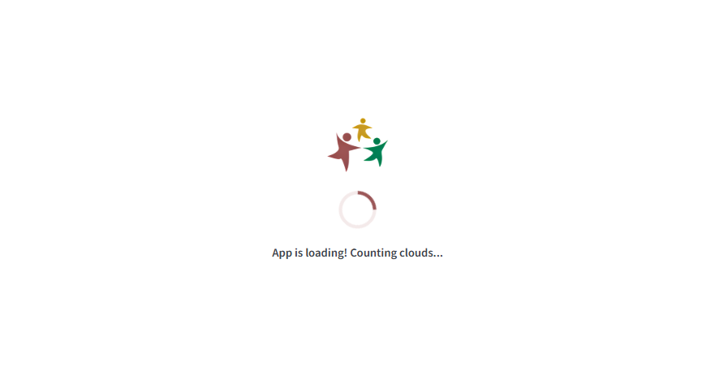

A full-page white cover with the logo, a spinner in the theme colour and a random message, shown until the first `shiny:idle` (or
`timeout` seconds, default 20) and then faded out and removed. `cd_app_ui()` puts it first in `<body>` (its critical style is inline so
it covers the page before `cd-ui.css` applies), so do not add it yourself. `messages` is the list it picks from. It replaced the
waiter/hostess packages.

### `cd_head_assets()`

`<head>` tags: `cd-ui.css`, `fonts.css`, `i18n-fix.js` (a workaround for a shiny.i18n bug that logged an error on every language change),
each with `?v=<file mtime>` so browsers do not keep an old copy. Put it once in `cd_app_body()`.

### `cd_cfg()`

`cd_cfg(key, default = NULL)` reads the app's `options(cd2030.config = list(...))`; a value may be a function, evaluated when read. This is
how the shared modules get the things that differ per app. Keys are listed in `R/core/config.R` and the README. Read it inside functions
(at call time), never at the top level of a file: top-level code runs before the app has set its options.

---

## 2. Pages and the registry

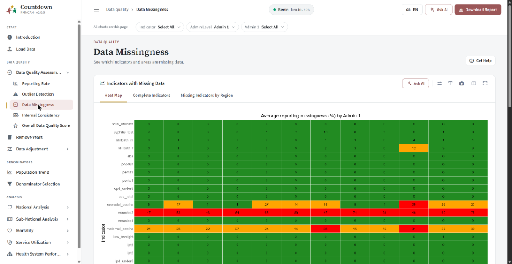

An analysis page is a *module* (`<name>_ui`, `<name>_server`) plus one **registry entry** in the app's `pages.R`. The registry holds
everything about a page that is not its content: title, section, subtitle, help chapter, whether it shows the denominator row, the report
key. So a module never repeats them and `cd_app()` can build all page containers, headers and servers from one list.

### `cd_page_def()`, `cd_use_pages()`, `cd_page_meta()`

```r
cd_page_registry <- list(
  cd_page_def(
    id = "national_target",                     # the tab name AND the module id
    ui = national_target_ui, server = national_target_server,
    title = "title_nav_global_coverage",        # translation keys
    section = "title_nav_national_analysis",    # the small heading above the title
    subtitle = "sub_target_national",
    help = c("national-global-coverage"),       # c(help chapter, optional section) for Get help
    denominator = TRUE,                         # show the "Denominator" row under the header
    report = NULL,                              # key used by Generate report / Add notes, if the page has them
    server_args = list(),                       # extra arguments for the server
    active = TRUE                               # FALSE: the server is not given `active`
  )
)
cd_use_pages(cd_page_registry)                  # once, at the end of pages.R
```

`cd_page_meta(id)` returns one entry (used by `cd_page_ui()`). A page with `report` set gets a **Generate report** button in its header
(`page_denominator_selection.png` shows one).

### `cd_page_ui()`

`cd_page_ui(id, i18n, ..., filters = NULL)` is a page module's whole UI: it looks the page up in the registry, builds the header, the optional
filter bar (`filters = cd_filter_bar(...)`) and the content (`...`). Use it for every registry page.

```r
my_page_ui <- function(id, i18n) {
  ns <- NS(id)
  cd_page_ui(id, i18n,
    filters = cd_filter_bar(cd_indicator_ui(ns("indicator"), i18n)),
    cd_chart_card(...), cd_table_card(...))
}
```

### `cd_pages_ui()`, `cd_pages_server()`

Used by `cd_app()`: `cd_pages_ui(pages, i18n)` builds one `cd_screen()` per entry; `cd_pages_server(pages, cache, i18n, page_is)` starts each page
server with `active = page_is(id)` and each page's header server. You only call them in a custom app.

### `cd_page_header()` and `cd_denominator_row()`

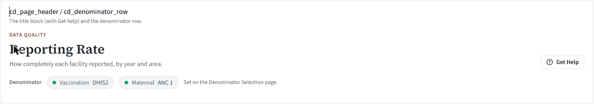

The title block: eyebrow (section), title, subtitle, and the buttons on the right (Get help, and, when the registry asks, Add notes and
Generate report), plus the optional **denominator row** (which denominators the numbers were divided by).

```r
cd_page_header(id, title, i18n, include_report = FALSE, include_notes = FALSE, include_help = TRUE,
               eyebrow = NULL, subtitle = NULL, include_denominator = FALSE)
cd_denominator_row(vaccination, maternal = NULL, i18n)          # maternal chip only when given
cd_page_header_server(id, cache, path, section = NULL, i18n, key = id)
```

`cd_page_ui()` builds this from the registry and `cd_pages_server()` starts the server half, so call these directly only for a page that is
not in the registry (the Load Data page: `cd_page_header(id = ns("load_data"), ...)` then `cd_page_content(...)`). The denominator row shows
the maternal chip only when the app's group has a maternal denominator (`cd_has_maternal()`).

### `cd_page_body()`, `cd_page_content()`, `cd_tag_assert()`

`cd_page_body(dashboardId, dashboardTitle, i18n, ..., filters, ...)` is what `cd_page_ui()` calls (header + filters + content); `cd_page_content(...)` is
the padded content wrapper. `cd_tag_assert()` is an internal shape check for the pieces passed to `cd_app_ui()`.

### Scoped pages: `cd_scope()`, `cd_scoped_page_ui()`, `cd_scoped_page_server()`

Pages that are *the same analysis at a different geography* (national vs sub-national coverage, target, inequality) differ only in which admin-level
filters they show and what admin level / region they hand to the analysis module. A scoped page says just that.

```r
cd_scope(kind = c("national", "level", "region", "level_region"), fixed_level = NULL, show_district = FALSE)
```

| `kind` | Filters shown | The analysis gets |
| --- | --- | --- |
| `"national"` | none | `admin_level = "national"`, no region |
| `"level"` | an admin-level chip | the chosen level, no region |
| `"region"` | a region chip only | `fixed_level` (default `"adminlevel_1"`) and the region |
| `"level_region"` | both chips (`show_district = TRUE` lets districts be picked as regions) | level and region |

```r
subnational_target_ui <- function(id, i18n)
  cd_scoped_page_ui(id, i18n, cd_scope("region", fixed_level = "district"), target_ui)
subnational_target_server <- function(id, cache, i18n, active = reactive(TRUE))
  cd_scoped_page_server(id, cache, i18n, cd_scope("region", fixed_level = "district"), target_server, active)
```

The inner module has the signature `inner_ui(id, i18n, ...)` and `inner_server(id, cache, i18n, admin_level, region, active)`. `cd_scope_filters()` and
`cd_scope_server()` are its two halves. **Related:** `cd_admin_level_ui/_server`.

---

## 3. Filters and inputs

Filters live in a **filter bar**: chips (small pill buttons that open a popover) for the values that apply to a whole page, or, further down a
page, an inline **map options** bar. Larger forms use the always-visible *field* inputs.

### `cd_filter_bar()`

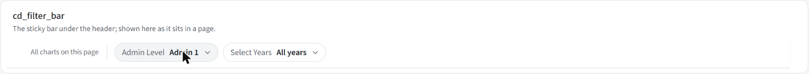

`cd_filter_bar(..., i18n, lead = "lbl_filter_scope_page", class = NULL)` - the one-line bar just under the header, sticky while the page scrolls, full
width. `lead` is its small label (default "All charts on this page"). Pass it as `cd_page_ui(filters = )`. In a real page it looks like the top of
`page_data_missingness.png` (Indicator, Admin Level, Admin 1). **Related:** `cd_map_options()` (the inline variant), the chips below.

### `cd_map_options()`

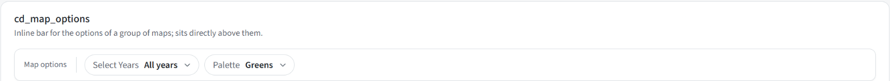

The **inline** filter bar for the options of a *group of maps* (years, palette). It is not sticky and not full-bleed: put it directly above the
map cards so it is clear it applies to them, not to the whole page.

```r
cd_map_options(
  cd_chip_multi(ns("years"), "title_global_select_years", i18n = i18n),
  cd_palette_chip(ns("palette"), i18n))
```

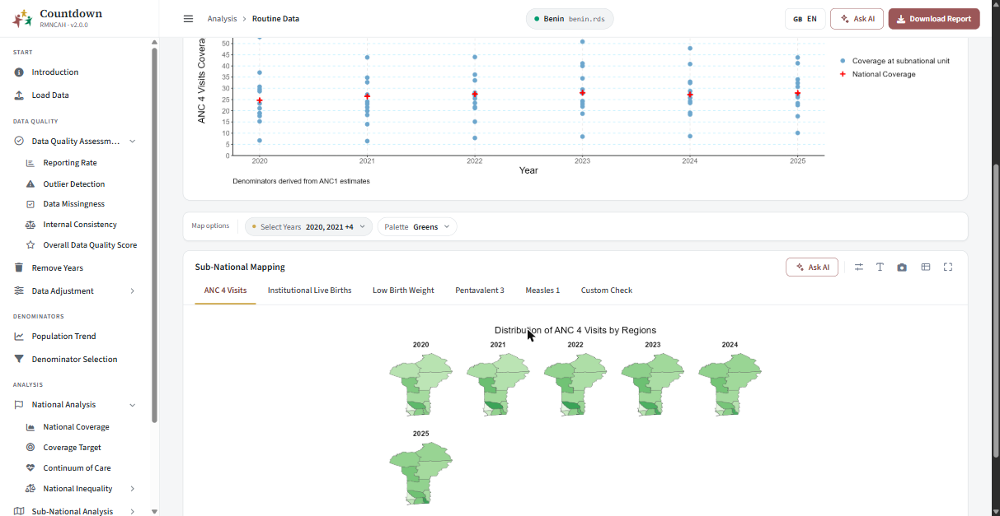

Its label is `lbl_filter_scope_maps` ("Map options"). **Related:** `cd_filter_bar` (it is `cd_filter_bar(class = "cd-filterbar--inline")`), `cd_palette_chip`,
`cd_years_input`.

### `cd_chip_select()`


A single-choice chip: shows "label **value**" and opens a small list.

```r
cd_chip_select(inputId, label, choices = NULL, i18n, selected = NULL, hint = NULL, default = NULL,
               options = NULL, key = NULL, allow_empty = FALSE)
```

| Argument | Meaning |
| --- | --- |
| `choices` | `c(<translation key> = "value")`; the value goes to `input$<inputId>` |
| `options` | build the list yourself for data-driven lists (regions, years): `cd_plain_options(values, groups)` |
| `selected` | initial value; **defaults to the first option**. Use `""` when the real value comes from the cache and will be pushed in |
| `hint` | translation key of a tooltip shown in the popover |
| `default` | when given, the chip is highlighted while it differs from `default` and offers a Reset |
| `key` | a changed `key` makes React remount the chip, which resets it to `selected` (used when the list changes underneath) |
| `allow_empty` | let the chip hold no value (denominator chips, which are filled from the cache) |

```r
cd_chip_select(ns("admin"), "title_global_admin_level",
               choices = c(opt_adminlevel_1 = "adminlevel_1", opt_district = "district"), i18n = i18n)
# server: input$admin;  cd_update_input("admin", session, value = "district")
```

**Related:** React `ChipSelect` (with `ChipFrame`, `OptionList`, `usePopover`); `cd_options()`, `cd_plain_options()`, `cd_chip_texts()`.

### `cd_chip_multi()`


A multi-choice chip (several years). Choosing **nothing means "all"**, and reaches the server as `""`.

```r
cd_chip_multi(inputId, label, choices = NULL, i18n, selected = NULL, hint = NULL, options = NULL, all_label = "lbl_all_years")
cd_years_sync(input, session, id = "years", years, selected)      # keeps its options and value in sync with the cache
cd_years_input(value, all_years)                                   # its value as integers; "" -> all_years
```

`""` is *all*, and `as.integer("")` is `NA`, and `NA` years plot nothing - so always turn the value into years with `cd_years_input()` before storing it:

```r
cd_years_sync(input, session, "years", years = reactive({ req(cache()); cache()$data_years }),
              selected = reactive({ req(cache()); cache()$mapping_years }))
observeEvent(input$years, cache()$set_mapping_years(cd_years_input(input$years, cache()$data_years)))
```

### `cd_chip_number()`

A chip that holds one number (a threshold), with optional quick picks. `cd_chip_number(inputId, label, i18n, value, min, max, step, unit = "", picks = NULL, default = NULL, hint = NULL)`. It validates min/max as
you type; `picks` is a vector of preset values shown as buttons. Example: Reporting Rate's *Performance Threshold* (`90%`).

### `cd_palette_chip()`

`cd_palette_chip(inputId, i18n, first = "Greens")` - the colour palette chip for maps: Greens, Blues, Reds, Purples (`first` is the one it opens with;
Mortality Mapping opens on Reds, Service Utilization on Purples). Its value is an RColorBrewer palette name the core map functions accept
(`get_filtered_mapping_data(..., palette =)`, `filter_mortality_summary(..., palette =)`, `prepare_mapping_service_utlization(..., palette =)`). Goes inside
`cd_map_options()`.

### `cd_field_number()`, `cd_field_select()`, `cd_checkbox()`, `cd_text_area()`


Labelled inputs that are always visible (forms, the wizard), not popover chips. Above: an out-of-range number is red with the range in place of the hint; a
required empty one is amber.

```r
cd_field_number(inputId, label, i18n, value = NULL, min = NULL, max = NULL, step = NULL, hint = NULL,
                required = FALSE, requiredLabel = NULL, unit = NULL)
cd_field_select(inputId, label, choices = NULL, i18n, value = NULL, hint = NULL, options = NULL)
cd_checkbox(inputId, label, i18n, value = FALSE, disabled = FALSE)          # input$<id> is TRUE/FALSE
cd_text_area(inputId, label = NULL, i18n, value = "", placeholder = NULL, height = 150)
```

* `cd_field_number`: validates min/max **live** and shows the message inline; `unit` is a trailing addon inside the field (`"%"`); with `required = TRUE` an empty
  field shows `requiredLabel` (amber). Its value is a number (or `NULL` when empty).
* `cd_field_select`: `value` is the selected value as a **string** (`"0.5"`); it does not pick a default by itself, so pass `value`.
* Push a value with `cd_update_input("k_anc", session, value = "0.5")`, after the field has mounted.
* `cd_text_area` height is in px.

**Related:** React `FieldNumber`, `FieldSelect`, `CdCheckbox`, `CdTextArea`; CSS `.cd-field-stack`, `.cd-field-grid`, `.cd-field-label`; `cd_button` for the form's action.

### `cd_admin_level_ui()` / `cd_admin_level_server()` / `cd_admin_parts()`

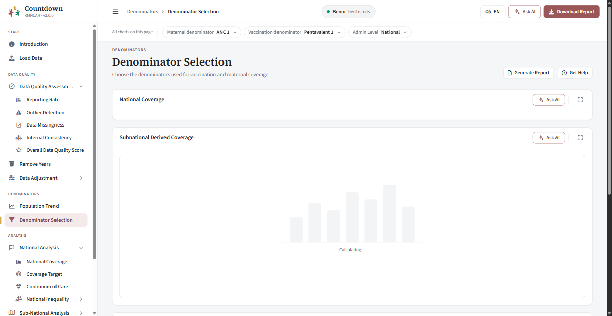

The admin-level chip plus the region chip (regions of that level, districts grouped under their parent).

```r
cd_admin_level_ui(id, i18n, include_national = FALSE, show_admin_level = TRUE)
cd_admin_level_server(id, cache, i18n, allow_select_all = FALSE, show_district = TRUE, show_region = TRUE,
                      show_admin_level = TRUE, selected_admin1 = reactive(NULL))
cd_admin_parts(admin)                          # list(admin_level = reactive, region = reactive)
```

The server returns a reactive `list(admin_level, region)`. `region` is `NULL` when the region chip is not offered or "all" is chosen.
`show_admin_level = FALSE` fixes the level to admin 1 (or district when `show_district`); `include_national` adds National to the level chip.

```r
filters = cd_filter_bar(cd_admin_level_ui(ns("admin"), i18n))
admin <- cd_admin_level_server("admin", cache, i18n)
parts <- cd_admin_parts(admin); admin_level <- parts$admin_level; region <- parts$region
```

The region chip keeps rendering while its page is hidden (`suspendWhenHidden = FALSE`) because the whole page waits for its value. **Related:** `cd_scope`
(builds this for you), `cd_region` options come from `cache()$subnational_regions`.

### `cd_indicator_ui()` / `cd_indicator_server()`

`cd_indicator_ui(id, i18n, label = NULL, tooltip = NULL, indicators = NULL, select_all = FALSE)` - an indicator chip; `indicators` defaults to `get_all_indicators()`
(so it follows the app's group); `select_all = TRUE` adds an "All" entry whose value is `""`. `cd_indicator_server(id)` returns `reactive(input$indicator)`. Used on
Reporting Rate, Outlier Detection, Data Missingness and in the Custom tab. The tooltip is a translation key.

### `cd_denominator_ui()` / `cd_denominator_server()` and helpers

`cd_denominator_ui(id, i18n, allow_input = FALSE, is_maternal = FALSE)` / `cd_denominator_server(id, cache, i18n, label, allowInput = FALSE, is_maternal = FALSE, display_mode = "combined")`.
A chip kept in sync with the cache's vaccination (or maternal) denominator; choosing writes it to the cache. Helpers:

| Function | Purpose |
| --- | --- |
| `cd_denominator_options()` | the options offered: `options(cd2030.denominator_choices)` or the rmncah default |
| `cd_has_maternal()` | `cd_cfg("has_maternal")`, falling back to "the group is not vaccine" |
| `cd_only_denominators(x)` | keep the entries of a named list/vector that are denominators this app offers (plus `"un"`); used for chart legends |

### `cd_population_ui()` / `cd_population_server()`

The population-source select on Denominator Assessment (`cd_population_ui(id)`, `cd_population_server(id, cache)`); it keeps the cache's derivation population in sync.

---

## 4. Cards, tabs and charts

### `cd_card()`


The basic card. Use it for forms and static content; a chart or table has its own wrapper below.

```r
cd_card(..., title = NULL, subtitle = NULL, footer = NULL, status = NULL, solidHeader = FALSE, background = NULL,
        width = NULL, height = NULL, collapsible = FALSE, collapsed = FALSE, toolbar = NULL, tabs = NULL, icon = NULL, i18n)
```

`title` / `subtitle` are translation keys (rendered by the React `CardHeader`, so they change language live); `status` tints the card (`"success"`, `"danger"`);
`toolbar` is UI shown top-right of the header; `tabs` a tab strip shown under the header; `collapsible` adds a collapse toggle; `icon` a Font Awesome name
before the title; `width` is accepted and ignored (a card is always a full-width block - use `cd_card_row()` for two side by side).

### `cd_chart_card()`, `cd_table_card()`, `cd_card_row()`

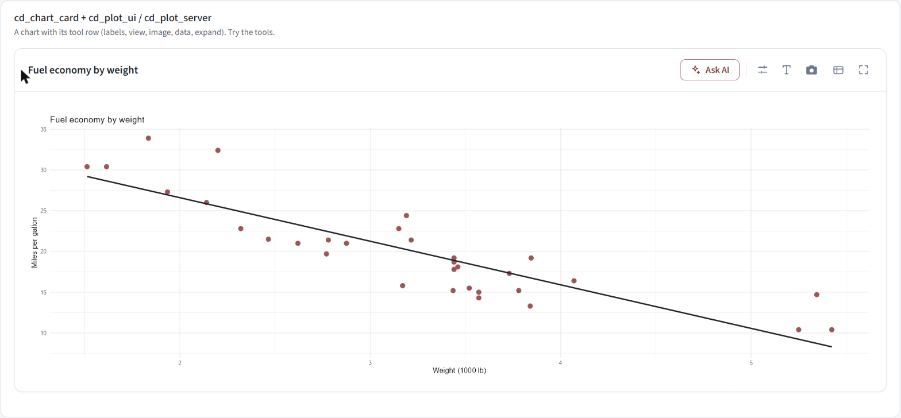

A card pre-wired for a chart, with the standard chart tool row in its header:

```r
cd_chart_card(title, chart_toolbar, ..., i18n, tabs = NULL, width = 6, icon = NULL)
```

`chart_toolbar` is the tool row for the chart that is showing (`cd_plot_toolbar_ui(ns("c"))`, or a `uiOutput` that resolves to one for a tabbed card whose chart changes);
`tabs` a `cd_tab_strip()`. The header holds, left to right: Ask AI, a divider, the chart's tools (view options, labels, download image, download data), expand.
`cd_table_card(title, ..., i18n, table_toolbar = NULL, width = 6)` is the table equivalent (only a download button and expand). `cd_card_row(...)` puts two cards on one row:

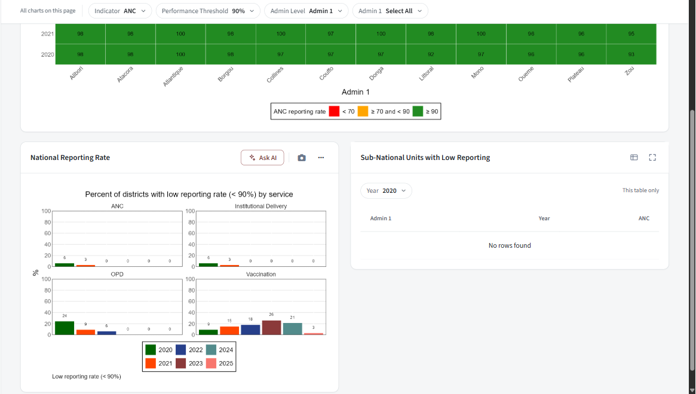

In a narrow card (a half-width card in a row, or a small window) the optional tools fold behind a **"..."** button (`cd-tool-optional`, `cd_more_tools_button()`),
leaving Ask AI and the camera; and a collapse chevron appears (`cd_collapse_chevron()`). Parts: `cd_card_header`, `cd_chart_toolbar`, `cd_table_toolbar`.

### `cd_plot_ui()` / `cd_plot_server()` - a chart with its tools

The chart itself: a plot output with the standard tools.

```r
cd_plot_ui(id, toolbar_inline = FALSE)
cd_plot_server(id, i18n, plot_data, plot_fun, plot_filename = reactive("plot"),
               plot_label_key = "btn_global_download_plot", plot_extension = reactive("png"),
               data_label_key = "btn_global_download_data", data_extension = reactive("xlsx"),
               excel_write_fun = NULL, excel_sheet = NULL, excel_title = NULL)
```

| Argument | Meaning |
| --- | --- |
| `plot_data` | a **reactive** of the data the plot draws |
| `plot_fun` | `function(d)` returning a ggplot (or drawing base graphics); it gets the *evaluated* data |
| `plot_filename` | reactive; the download's base name (a timestamp is added) |
| `excel_sheet` / `excel_title` | translation keys of the sheet name and an optional title - enables **Download data** for the one-sheet case |
| `excel_write_fun` | `function(wb, d)` for anything else (several sheets, other data); use `cd_add_sheet()` |
| `toolbar_inline` (ui) | `FALSE`: the tool row overlays the chart. `TRUE`: the tools are rendered elsewhere (in `cd_chart_card(chart_toolbar = cd_plot_toolbar_ui(id))`) |

```r
# UI
cd_chart_card("title_consist_ratio_plots", chart_toolbar = cd_plot_toolbar_ui(ns("ratios")), i18n = i18n,
              cd_plot_ui(ns("ratios"), toolbar_inline = TRUE))
# server
cd_plot_server("ratios", i18n = i18n,
  plot_data = reactive({ req(cache(), active()); cache()$ratios_summary }),
  plot_fun = function(d) plot(d, title = i18n$t("plt_title_consist_ratios")),
  plot_filename = reactive("ratio_plot"), excel_sheet = "ratio_plot")
```

The tools, each its own popover, act on **this chart only** and also apply to the downloaded image:

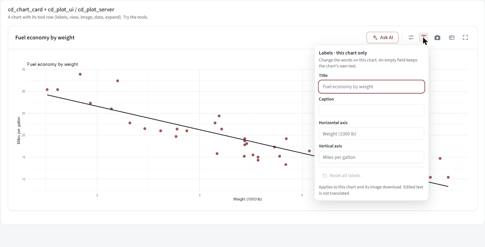

*Labels* (the **T** icon): edit the title, caption and axis titles; an empty field keeps the chart's own text; "Reset all labels".

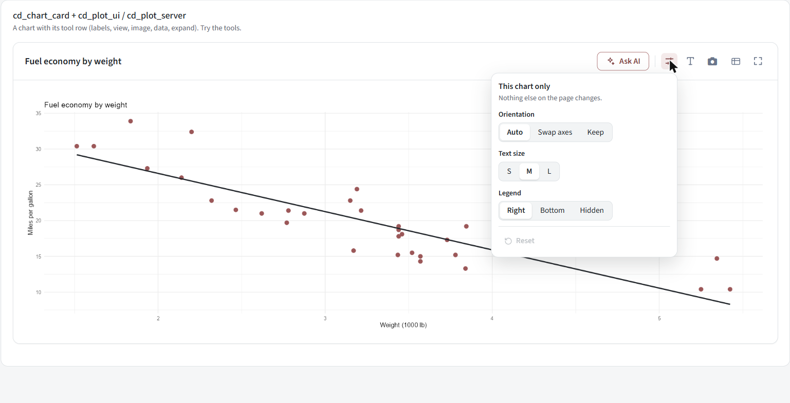

*View* (the sliders icon): orientation (Auto / Swap axes / Keep), text size (S/M/L), legend position (Right / Bottom / Hidden), Reset. The camera downloads the image, the table
icon the data, the arrows toggle full-screen.

**How it works.** `plot_fun` runs once per data change to build the ggplot; the label and view options are applied on top of it (`cd_apply_chart_options()`, `cd_chart_layout()`,
`cd_chart_axes()`, `cd_chart_label_defaults()`), never inside `plot_fun`. The renderer `cd_render_plot()` shows a skeleton while calculating, rethrows errors (a red message in the card, never a silent blank)
and grows the plot when the card is expanded (`cd_plot_client_height()`). `cd_plot_output(id)` is the plain output. **Note:** `str_glue(i18n$t("template"))` inside `plot_fun` reads `{names}` from the function around it, so
define the variables the template uses (e.g. `vacc1`, `vacc2`) in `plot_fun` first. **Related:** React `ChartLabels`, `ChartView`, `ExpandButton`, `ToolFrame`; `cd_chart_labels()`, `cd_chart_view()`, `cd_expand_button()`, `cd_ask_ai_button()`.

### `cd_tab_strip()`, `cd_tab_panes()`, `cd_update_tab_panes()`


Tabs that switch content **in place** (they are real `<button>`s, not links).

```r
cd_tab_strip(ns, tabs, active)                              # tabs: c(key = "Label"); buttons have ids <ns>tab_<key>
cd_tab_panes(id, panels, active = names(panels)[[1]])       # panels: list(key = <ui>)
cd_update_tab_panes(session, id, selected)                  # in the server: show pane `selected`
```

The pattern (used by Reporting Rate, Outlier Detection, Consistency Checks and, generically, `cd_tabbed_charts_*`):

```r
# UI
cd_card(title = "Tabbed card", tabs = uiOutput(ns("tabs")), cd_tab_panes(ns("panes"), list(a = ..., b = ...)))
# server
current <- reactiveVal("a")
output$tabs <- renderUI(cd_tab_strip(ns, c(a = "Penta3", b = "Measles1"), current()))
lapply(c("a", "b"), function(k) observeEvent(input[[paste0("tab_", k)]], {
  current(k); cd_update_tab_panes(session, "panes", k)          # `tab_<k>`: the strip's button id
}, ignoreInit = TRUE))
```

Hidden panes are not computed (Shiny suspends hidden outputs), so only the visible tab's chart is built.

### `cd_tabbed_charts_ui()` / `cd_tabbed_charts_server()` - one tab per indicator

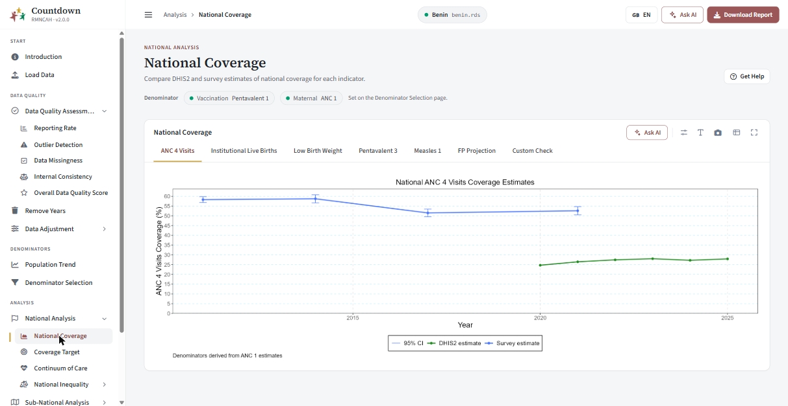

The standard card for a set of indicators: a tab per indicator plus, by default, a **Custom Check** tab.

```r
cd_tabbed_charts_ui(id, i18n, title_key, uiInput, indicators = NULL, customIndicators = get_analysis_indicators(),
                    showCustom = TRUE, width = 12)
cd_tabbed_charts_server(id, serverInput, indicators = NULL, customIndicators = get_analysis_indicators(),
                        showCustom = TRUE, selected_tab = reactive(NULL), i18n = cd_i18n())
```

| Argument | Meaning |
| --- | --- |
| `uiInput` | the per-tab UI function, normally `cd_coverage_plot_ui` |
| `serverInput` | `function(id, current_indicator)` building that tab's server, normally a `cd_coverage_plot_server()`. Called once per indicator, and once more with `id = "custom"` when a custom indicator is picked |
| `indicators` | the tab keys. `NULL` means the app default (`cd_default_indicator_set()`: `options(cd2030.default_indicators)`, a vector or a function) |
| `customIndicators` | what the Custom tab's picker offers (default: every analysis indicator of the group) |
| `showCustom` | show the Custom tab. **Pass the same value to both the `_ui` and the `_server` call**, or the strip and the panes disagree |
| `selected_tab` | a reactive that drives which tab is showing (National Inequality drives its map's tab) |

The server returns a reactive with the tab that is showing.


```r
# UI
cd_tabbed_charts_ui(ns("panel"), i18n, "title_target", cd_coverage_plot_ui, indicators = cd_cfg("target_indicators"), showCustom = FALSE)
# server
cd_tabbed_charts_server("panel", indicators = cd_cfg("target_indicators"), showCustom = FALSE,
  serverInput = function(id, current_indicator) {
    data <- reactive({ req(cache(), active()); cache()$get_filtered_coverage(indicator = current_indicator, admin_level = "national") })
    cd_coverage_plot_server(id = id, filename = reactive(current_indicator), data_fn = data,
                            sheet_name = reactive(i18n$t(paste0("opt_", current_indicator))), i18n = i18n)
  })
```

Tab labels are `opt_<indicator>` translation keys, so every indicator an app offers needs one. `cd_default_indicator_set()` is what "the app default" resolves to.

### `cd_coverage_plot_ui()` / `cd_coverage_plot_server()`

`cd_coverage_plot_ui(id, toolbar_inline = FALSE)`; `cd_coverage_plot_server(id, filename, data_fn, ..., sheet_name, i18n, plot_fun = NULL)`; `cd_coverage_plot_toolbar_ui(id)`.
`cd_plot_server` specialised for the tabbed cards. `filename` and `sheet_name` are reactives; without `plot_fun` it calls `plot(d, ...)` on the core data object
(the `...` are passed to the core `plot()` method: `title`, `x_label`, `legend_labels`, ...); with `plot_fun = function(d) ...` you draw it yourself. The Excel sheet is `sheet_name()` with the data (a `geometry` column
dropped). The id nests one level deeper (`<id>-plot`), which `cd_coverage_plot_toolbar_ui()` mirrors.

---

## 5. Tables and downloads

### `cd_table_ui()` / `cd_table_server()`


A `reactable` table card with a **Year** or **Indicator** selector chip, a "This table only" note and a data download.

```r
cd_table_ui(id, i18n, title_key, control_type = c("year", "indicator"), width = 6)
cd_table_server(id, cache, i18n, data, columns = NULL, control_type = c("year", "indicator"), filename = reactive("download"),
                label_key = "btn_global_download_data", extension = reactive("xlsx"), data_transform = NULL,
                excel_write_fun = NULL, excel_sheet = NULL, excel_title = NULL)
```

`data` is a reactive of the full table; the selector filters it by year (or indicator) and the chosen value is appended to the download's file name. `columns` is a named list of `reactable::colDef()`;
`data_transform` is a `function(data, selected)` applied after filtering. `cd_rate_status_cell(value)` draws a reporting-rate cell as a shape plus the value (red triangle below 70, amber diamond 70 to below 90, green circle from 90), for
`colDef(cell = )`.

### `cd_download_button_ui()` / `cd_download_button_server()`

One download button (an `<a class="shiny-download-link cd-button">` with a busy state). The chart and table servers build theirs; use it directly for a new download.

```r
cd_download_button_ui(id)
cd_download_button_server(id, filename, extension, content, data, i18n, label = "btn_global_download", message = "msg_downloading",
                          icon = "download", icon_only = TRUE, tooltip = NULL, button_class = NULL, show_when_no_data = FALSE)
```

`filename` / `extension` / `data` are reactives; `content(file, data)` writes the file (`data` is already evaluated). The button is **debounced** (300 ms) so it does not flicker while the data settles, is disabled while
`data()` is `NULL` (unless `show_when_no_data`), and shows `message` while the file is being built (`cd_download_status()` / React `DownloadButtonStatus`). `icon_only = FALSE` shows the label (the Load Data
"Download Master Dataset" button).

```r
cd_download_button_server("download_data", filename = reactive("master_dataset"), extension = reactive("dta"), i18n = i18n,
  data = reactive(cache()$countdown_data), icon_only = FALSE, label = "btn_upload_download_master",
  content = function(file, data) haven::write_dta(data, file))
```

### `cd_add_sheet()`, `cd_sheet_writer()`

Excel export helpers. `cd_add_sheet(wb, name, x, title = NULL)` adds a worksheet holding `x` (title in row 1 and data from row 3 when a `title` is given, else data from row 1; a spatial `geometry` column is dropped).
`cd_sheet_writer(i18n, sheet, title = NULL)` returns `function(wb, d)` for the one-sheet case (what `excel_sheet =` builds). More than one sheet:

```r
excel_write_fun = function(wb, d) {
  cd_add_sheet(wb, i18n$t("title_outlier_extreme"), cache()$outliers_national, title = i18n$t("tab_outlier_extreme"))
  cd_add_sheet(wb, i18n$t("lbl_sheet_outlier_district"), cache()$district_outliers_summary, title = i18n$t("tab_outlier_district"))
}
```

---

## 6. Feedback, files and dialogs

### `cd_button()`


```r
cd_button(inputId, label = NULL, i18n, icon = NULL, variant = "default", size = "md", class = NULL, disabled = FALSE, block = FALSE, title = NULL)
```

`variant`: `"default"` (outlined), `"primary"` (filled with the theme colour), `"link"` (text), `"bare"` (no styling of its own; style it with `class`). `size`: `"sm"` / `"md"`. `icon`: a Font Awesome name. `block = TRUE` makes it full width. `title` is a
tooltip key. A click sets `input$<inputId>` to a fresh timestamp as a one-shot event. `label = NULL` gives an icon-only button. **Related:** React `CdButton`; CSS `.cd-button`, `.cd-button--primary`; used by
`cd_help_button_ui`, `cd_report_button_ui`, `cd_download_report_ui`.

```r
cd_button(ns("adjust_data"), "btn_adjust_execute", i18n, icon = "wrench", variant = "primary", block = TRUE)
observeEvent(input$adjust_data, { ... })
```

### `cd_status_banner()`


One always-visible banner: icon, bold title, description (and an optional monospace file name). `cd_status_banner(status, title, description = NULL, file = NULL, i18n, use_pre = FALSE)`; `status` is `"info"`, `"success"`, `"warning"` or
`"error"`. `title` is a key; `description` may be a key **or already-resolved text** (a dynamic error message). Example: `cd_status_banner("error", "title_upload_error_heading", st$message, i18n = i18n)`. **Related:** React `StatusBanner`, `StatusIcon`.

### `cd_message_ui()` / `cd_message_server()` / `cd_message_box()`

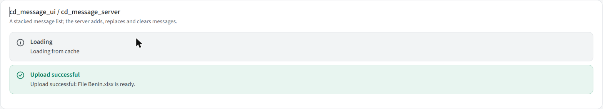

A message list that the server adds to, replaces and clears (upload progress, "adjusted / not adjusted").

```r
cd_message_ui(id, label = NULL, width = NULL)
msg <- cd_message_server(id, i18n = NULL, default_message = "msg_upload_awaiting", default_title = "title_msg_waiting", use_pre = FALSE, help_text = NULL)
msg$add_message(message, status = "info", parameters = NULL, title = NULL)
msg$update_message(message, status = "info", parameters = NULL, title = NULL)     # clear, then add
msg$clear_messages()
```

`message` and `title` are translation keys; `parameters` is a list filling `{placeholders}` in the translation (`list(details = "...")` for "The adjustment could not be applied: {details}"). Messages sent before the box has mounted are queued and delivered on
mount. `cd_message_box(id)` is the React renderer (`MessageBoxStatus`). Prefer `cd_status_banner()` for one fixed message.

### `cd_empty_state()`


Shown in place of something with nothing to show (a comparison with no survey data). `cd_empty_state(id, title, message, i18n, action_label = NULL)`; all three texts are keys. The optional button fires the one-shot input `<id>_action`:

```r
cd_empty_state(ns("goto"), "title_denom_coverage_empty", "msg_denom_coverage_empty", i18n = i18n, action_label = "btn_denom_goto_load_data")
observeEvent(input$goto_action, cd_navigate_to(session, "upload_data"))
```

### `cd_loading_skeleton()` / `cd_spinner()`


`cd_spinner(ui, i18n, min_height = NULL)` wraps any output; while it is calculating it shows a bar-chart skeleton with "Calculating...", and it swaps to the content when done. It starts in an "init" state (skeleton, output kept laid out but
invisible - not `display: none`, which would stop Shiny computing it) so a card never flashes "empty" first. `min_height` (px) is roughly the finished height, so the card does not resize. `spinner.ts` drives it from Shiny's
`recalculating` / `value` / `error` events; a *silent* error (a `req()` that is not ready) keeps the skeleton (for at most 4 s), a real error shows the message. `cd_loading_skeleton()` is the placeholder alone.


### `cd_tooltip()`


A small info icon with hover text: `cd_tooltip(text, label = NULL, status = NULL, i18n)` (`text` and `label` are keys; `status` tints the icon). Chips and fields take a `hint` argument instead, which shows the same kind of text in their popover.

### `cd_file_upload()`, `cd_directory_upload()`, `cd_reset_file_upload()`, `cd_set_file_upload()`

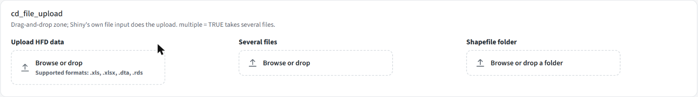

A drag-and-drop zone. Shiny's own file input does the upload (it is the real `<input type="file">` inside), so `input$<id>` is the usual data frame (`name`, `size`, `type`, `datapath`).

```r
cd_file_upload(id, label = NULL, hint = NULL, accept = NULL, i18n, multiple = FALSE)
cd_directory_upload(id, label = NULL, hint = NULL, accept = NULL, required_files = NULL, i18n)
cd_reset_file_upload(inputId, session)            # clear the zone
cd_set_file_upload(inputId, fileName, session)    # show `fileName` as the uploaded file (server truth)
```

`multiple = TRUE` takes several files (pooled uses it for `.rds` files); `cd_directory_upload` picks a folder (`required_files`: `c("<label key>" = "<filename prefix>")` shown as a checklist that fills in as files are chosen; the server still validates). The zone shows the file name with Replace / Reset once
a file is chosen. `cd_set_file_upload` / `cd_reset_file_upload` are plain custom messages (the zone is not a `shiny.react` input), so they need no mount check but do nothing if the zone is not there. **Related:** React `FileUploadZone`;
the wizard's upload steps (`upload_box_ui`, `survey_upload_ui`, `shapefile_step_ui`).

### `cd_show_dialog()` and friends

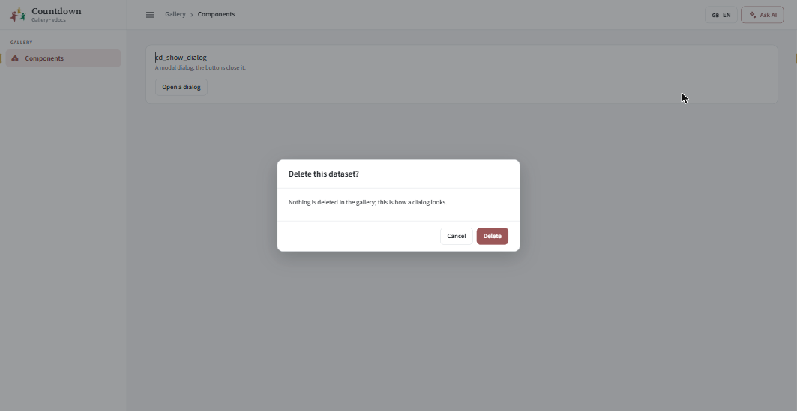

The replacement for `showModal()`. The dialog is ordinary markup inserted into the page, so inputs inside it are ordinary Shiny inputs.

```r
cd_show_dialog(title, ..., footer = NULL, easy_close = FALSE, size = c("md", "lg"), session)
cd_remove_dialog(session)
cd_dialog_close_button(label, primary = FALSE)      # a footer button that only closes it
cd_dialog(title, ..., footer, easy_close, size)     # the markup, if you need it as UI
```

One dialog at a time (id `cd-dialog`; showing another replaces it). `easy_close = TRUE` also closes on Escape or a click outside. `dialog.ts` handles closing. Example:
`cd_show_dialog("Delete this dataset?", p("This cannot be undone."), footer = tagList(cd_dialog_close_button("Cancel"), cd_dialog_close_button("Delete", primary = TRUE)))`. Used by Add notes and the region-mapping modal.

### `cd_mapping_modal()`

`cd_mapping_modal(id, label, title, regions, choices, existing = NULL, i18n)` - the "match your regions to the shapefile's" dialog content (React `MappingModal`): a search box, one row per region with a selector, an
auto-match on open (case, accent and fuzzy matches are tagged so the user can tell why), and duplicate / unmapped warnings. It is used by the wizard's mapping steps (`mapping_modal_ui/_server`); `cd_mapping_texts()` bundles its labels.

---

## 7. Actions

Page-level buttons in the header of a page (`cd_page_header()` builds them from the registry).

| Function | What it does |
| --- | --- |
| `cd_help_button_ui(id, name, i18n)` / `cd_help_button_server(id, path, section = NULL, cache)` | **Get help**: opens the documentation site in the browser, in the dataset's language (`datasuite.vercel.app/<lang>/docs/framework/`), at `#section` when the registry gives one |
| `cd_notes_button_ui(id, i18n)` / `cd_notes_button_server(id, cache, document_objects, page_id, page_name, i18n)` | **Add notes**: a dialog to attach a note to an object on the page, which goes into the report |
| `cd_report_button_ui(id, label, i18n)` / `cd_report_button_server(id, cache, report_name, i18n, adminlevel_1)` | **Generate report**: builds the report for this page as a Word document in the background and offers it for download |
| `cd_download_report_ui(id, i18n)` / `cd_download_report_server(id, cache, i18n)` | The header's **Download report**: the whole-country report, built in the background; a click on incomplete data shows an error dialog instead |

---

## 8. Shiny and translation helpers

### Talking to components (`R/core/shiny.R`)

| Function | Purpose |
| --- | --- |
| `cd_update_input(inputId, session, ...)` | push props (`value`, `options`, `editable`, ...) to a React input already on the page |
| `cd_mounted(input, id)` | a reactive TRUE once the React component `id` has mounted (first time only) |
| `cd_remounted(input, id)` | reflects **every** mount - use it for something that can be torn down and rebuilt (a wizard step re-entered from the landing page) so you re-sync each time |
| `cd_navigate_to(session, tab_name)` | move to a sidebar tab from the server (Load Data's "Continue to analysis") |
| `cd_set_language(session, lang)` | tell every React component the language changed (also call `shiny.i18n::update_lang(lang)` for plain text) |

```r
mounted <- cd_mounted(input, "years")
observeEvent(list(years(), mounted()), { req(mounted()); cd_update_input("years", session, options = cd_plain_options(years())) })
```

### Translation (`R/core/i18n.R`)

| Function | Purpose |
| --- | --- |
| `cd_use_i18n(i18n)` / `cd_i18n()` | register / read the app's translator; components default their `i18n` to it |
| `cd_text(i18n, key)` | a key as `list(en =, fr =, pt =)`, what React components take |
| `cd_plain_text(i18n, key, lang = NULL)` | a key as plain text in one language (the current one by default); the key itself if missing |
| `cd_label(i18n, x)` | a key -> its text in every language; anything else -> shown as is |
| `cd_key(x)` | unwrap the markup `i18n$t()` returns back to the key |
| `cd_label_glue(i18n, template_key, ...)` | a template with `{placeholders}` filled from other keys' text, per language |
| `cd_options(choices, i18n)` | `c(<key> = value)` -> option list with translated text |
| `cd_plain_options(values, groups = NULL)` | data as options (regions, years); `groups` adds group headings |
| `cd_chip_texts(i18n)` | the shared text every chip needs (Reset, Search, ...) |
| `cd_translations(app_file, extra = character())` | merge `shared.json` + the app's file (+ `extra` files) into one temp JSON for `init_i18n()`; later layers win |

### Assets and plumbing (`R/core/assets.R`)

`cd_react_element(name, props)` builds a `shiny.react` element for the component `name` in the bundle; `cd_react_dependency()` is the bundle's HTML dependency; `cd_icon_class(icon)` resolves a Font Awesome icon *name* to its CSS class (what React
components take).

---

## 9. The Load Data wizard

The wizard is how a dataset gets into an app. Seven steps, each a card; a rail on top shows where you are.

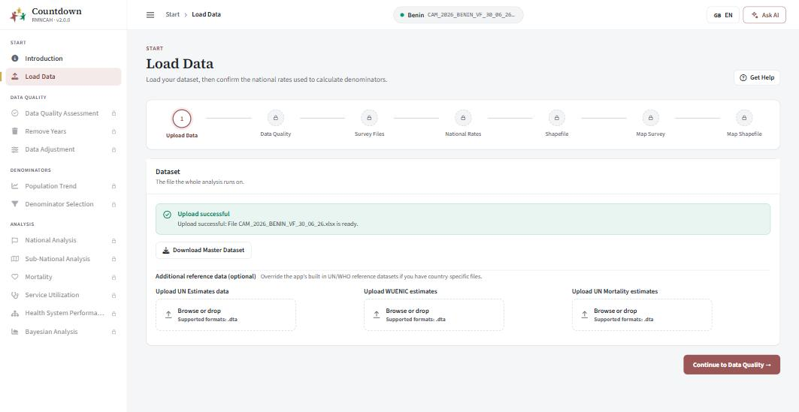

| Step (key) | What it is | Shared function |
| --- | --- | --- |
| Upload Data (`upload`) | the dataset (Excel / Stata / a saved `.rds`) and optional UN / WUENIC / mortality reference data | `upload_box_ui/_server`, `reference_estimates_ui/_server` |
| Data Quality (`quality`) | automatic checks on each sheet, blocking and informational | `data_quality_ui/_server` |
| Survey Files (`survey_files`, optional) | national, regional, area, education and wealth survey files | `survey_upload_ui/_server` |
| National Rates (`national_rates`) | the survey coverage estimates and national rates the denominators use | `national_rates_ui/_server` |
| Shapefile (`shapefile`, optional) | a folder with the country's shapefile, else the built-in one | `shapefile_step_ui/_server` |
| Map Survey (`survey_mapping`) | match the dataset's regions to the survey's | `map_survey_ui/_server` |
| Map Shapefile (`map_mapping`) | match them to the shapefile's | `map_shapefile_ui/_server` |


### How it behaves

* **A fresh Excel upload** is kept as separate sheets (`cache$wizard_parts`) and merged only at **Finish**, so every check can say *which sheet* has a problem. `.dta` and `.rds` files load already merged.
* **Locking.** On a fresh walkthrough a step opens only once the step before it has been continued or skipped past (the rail shows the rest with a padlock, and so does the sidebar until Finish). Editing a finished dataset unlocks everything. A step
  shows as complete on the rail only after you have moved past it; the real `complete` state (`compute_step_states()`) is what gates Continue.
* **Resume.** Uploading `Benin.xlsx` again loads that app's saved copy `Benin_<group>.rds` (`cd_saved_copy_name()`) if there is one, skipping the walkthrough; a saved copy that cannot be read is ignored and the original is loaded.
* **The group.** The dataset must be for this app's indicator group (`cd_wizard_check_group()`); another group's `.rds` is refused with a message.
* **Finish** merges and standardises the sheets (`merge_and_standardize()`), adds the synthetic admin-1 keys, writes `<file>_<group>.rds` and lands on a summary page (below).


### The pieces

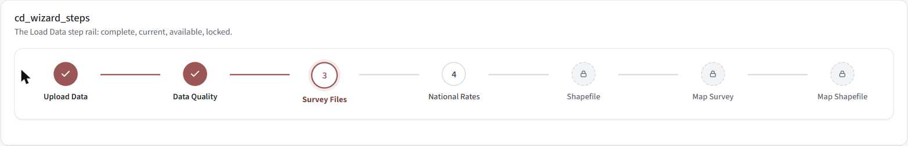

| Function | Purpose |
| --- | --- |
| `wizard_steps_ui(id)` / `wizard_steps_server(id, i18n, cache, requires_walkthrough, panels, source_path, active, step_defs)` | the rail, the panels, the footer (Back / Skip / Continue / Finish), the landing summary and the Finish sequence. `panels` is `list(list(key =, ui =), ...)` in step order |
| `cd_wizard_steps(inputId, steps, i18n)` | the rail component; `input$<inputId>` is the clicked step key |
| `wizard_step_defs`, `compute_step_states(cd, current, requires_walkthrough, step_defs, acknowledged)`, `step_*_complete(cd)` | the step list and its completion rules; each state has `key`, `status` (what the rail shows), `complete`, `locked`, `required`, `relevant` |
| `wizard_landing_ui/_server` | the summary after Finish, with an Edit link per step |
| `upload_box_ui(id, i18n, is_electron)` / `upload_box_server(id, i18n, cdsuite_file, is_electron)` | dataset upload; returns `cache`, `requires_walkthrough`, `source_path` |
| `nr_field()`, `nr_group()` | one national-rate field and one group of them |
| `mapping_modal_ui/_server`, `mapping_provenance_banner()` | the region-mapping dialog and the banner saying how a mapping was made |

### Per-app configuration

Everything above is identical for every indicator group. An app states only its own part, once, in its `modules/0_upload_data.R` (which also assembles the panels and defines `upload_data_ui` / `upload_data_server`):

```r
options(cd2030.wizard = list(
  national_rates_groups = list(
    cd_wizard_field_group("title_upload_group_maternal", "sub_upload_group_maternal",
      cd_wizard_survey_field("anc1_prop", "anc1", "title_upload_anc1_survey"),  # input id, name in cache$survey_estimates, label key
      cd_wizard_national_rate_fields()),                                        # nmr, pnmr, sbr, twin_rate, preg_loss
    cd_wizard_field_group("title_upload_group_immunization", "sub_upload_group_immunization",
      cd_wizard_survey_field("penta3_prop", "penta3", "title_upload_penta3_survey"))
  ),
  reference_uploads = c("un_estimates", "wuenic_estimates")     # rmncah also has "un_mortality_estimates"
))
```

`cd_wizard_survey_field(id, key, label_key)` is a percent (0-100); `cd_wizard_rate_field(id, key, label_key)` a proportion (0-0.05); `cd_wizard_field_group(title_key, subtitle_key, ...)` a card of fields
(single fields and/or lists of fields such as `cd_wizard_national_rate_fields()`). **Every listed field is required** before Continue is enabled. `cd_wizard_config()` reads and validates the option;
`cd_wizard_indicator_group()` is the app's group (`options(cd2030.app_group)`).

---

## 10. Shared page modules

Pages that are identical for every indicator group live in `R/modules/` and are used by both apps; an app's `pages.R` just names them. They read what differs per app with `cd_cfg()`
(see the README's config table). Each is `<page>_ui(id, i18n)` / `<page>_server(id, cache, i18n, active)`.

| Page (registry id) | Module | Reads from config | Built from |
| --- | --- | --- | --- |
| `reporting_rate` | `reporting_rate` | `reporting_rate_indicators`, `reporting_rate_facet_ncol` | tabbed chart card, table card, national chart card |
| `outlier_detection` | `outlier_detection` | - | indicator + admin filters, tabbed heat maps, tables |
| `data_completeness` | `data_completeness` | - | indicator (with "All") + admin filters, tabs, table |
| `internal_consistency` | `internal_consistency`, `calculate_ratios`, `consistency_check` | `consistency_pairs` | ratio chart, one tab per pair + Custom Check |
| `overall_score` | `overall_score` | - | table, chart |
| `remove_years` | `remove_years` | - | years form |
| `data_adjustment` | `data_adjustment` | `k_factors` | form (one select per factor), message box |
| `data_adjustment_changes` | `adjustment_changes` | `adjustment_indicators`, `k_factors` | `cd_tabbed_charts` |
| `denominator_assessment` | `denominator_assessment` | - | population select, tabbed chart |
| `denominator_selection` | `denominator_selection`, `coverage_trends`, `survey_comparison`, `subnational_denominator` | `cov_trend_indicators`, `survey_comp_indicators`, `sub_derived_indicators`, `has_maternal` | denominator chips + three tabbed cards |
| `national_coverage` (+ sub-national) | `national_coverage`, `coverage` | `nat_cov_indicators` | `cd_scoped_page_*` + `cd_tabbed_charts` |
| `national_target` (+ sub-national) | `national_target`, `target` | `target_indicators` | `cd_scoped_page_*` |
| `national_inequality` | `national_inequality`, `inequality`, `subnational_mapping` | - | `cd_map_options` + two tabbed cards driven together |
| `subnational_inequality` | `subnational_inequality` | - | `cd_scoped_page_*` |
| `equity_assessment` | `equity` | `equity_indicators`, `equity_custom_exclude` | `cd_tabbed_charts` |
| (Introduction, not in the registry) | `introduction` | - | a help markdown per language |

Anything genuinely specific to one group stays in that app's `modules/` (rmncah's mortality, service utilization, health-system and Bayesian pages; each app's `0_upload_data.R`).


---

## 11. Themes

`cd_app(theme = ...)` puts `cd-theme-<name>` on `<body>`; the last block of `www/cd-ui.css` ("App themes") re-declares five tokens (`--cd-primary`, `--cd-primary-hover`, `--cd-primary-rgb`, `--cd-primary-ink`, `--cd-primary-tint`). Components only use the tokens, so
a new theme is one CSS block. **Never hard-code a brand colour in a component.**

| Theme | `theme =` | Colour | Used by |
| --- | --- | --- | --- |
| default | `"rmncah"` or `NULL` | maroon `#9b5758` | rmncah |
| vaccine | `"vaccine"` | blue `#2f6db5` | vaxx |
| pooled | `"pooled"` | green `#1f8a5f` | pooled |


---

## 12. The React side

R function -> React component (`js/src/components/*.tsx`), all registered in `js/src/index.ts` under `window.jsmodule["@/countdown"]` and created from R by `cd_react_element("<Name>", props)`.

| R | React component | Notes |
| --- | --- | --- |
| `cd_button` | `CdButton` | one-shot event via `setInputValue(id, Date.now(), {priority: "event"})` |
| `cd_checkbox`, `cd_text_area` | `CdCheckbox`, `CdTextArea` | |
| `cd_chip_select`, `cd_chip_multi`, `cd_chip_number` | `ChipSelect`, `ChipMulti`, `ChipNumber` | share `ChipFrame`, `OptionList`, `usePopover` |
| `cd_field_number`, `cd_field_select` | `FieldNumber`, `FieldSelect` | send `input$<id>__mounted` |
| `cd_file_upload`, `cd_directory_upload` | `FileUploadZone` | wraps Shiny's native file input (not an `InputAdapter`) |
| `cd_mapping_modal` | `MappingModal` | uses `matching.ts` |
| `cd_status_banner`, `cd_message_box` | `StatusBanner`, `MessageBoxStatus` | share `StatusIcon` |
| `cd_tooltip`, `cd_loading_skeleton`, `cd_empty_state` | `Tooltip`, `LoadingSkeleton`, `EmptyState` | |
| `cd_chart_labels`, `cd_chart_view`, `cd_expand_button` | `ChartLabels`, `ChartView`, `ExpandButton` | share `ToolFrame` |
| `cd_card_header` | `CardHeader` | |
| `cd_wizard_steps` | `WizardSteps` | |
| `cd_download_status` | `DownloadButtonStatus` | |
| `cd_shell_server` (sidebar, header) | `Sidebar`, `HeaderBreadcrumb`, `HeaderActions` (in `HeaderBar.tsx`) | |

Scripts that are not components: `lang.ts` (the `cd-lang` message and `useLang()`; every text prop is `{en, fr, pt}` shown with `tr(text, lang)`), `nav.ts` (top-level page switching, sidebar and collapse state, the `cd-navigate` message, a `resize` after each switch so
Shiny re-checks which outputs are visible), `tabswitch.ts` (`cd-tab-switch`, for `cd_update_tab_panes`), `spinner.ts` (the skeleton state machine), `dialog.ts` (closing dialogs), `matching.ts` (region auto-matching), `usePopover.ts`.

Build: `cd js && npm run build` (type-check, then webpack) writes `apps/_shared/www/cd-react/cd-react.js`, which is committed. See `HOWTO.md` -> "Add a React component".
